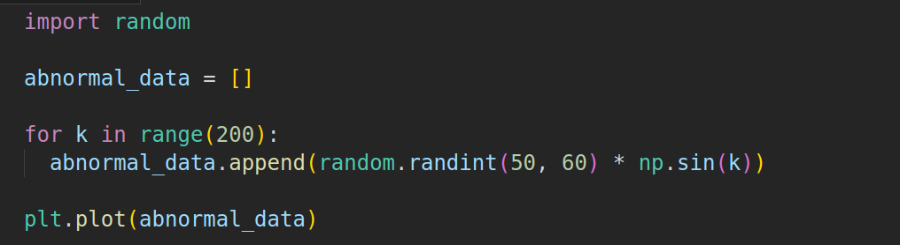
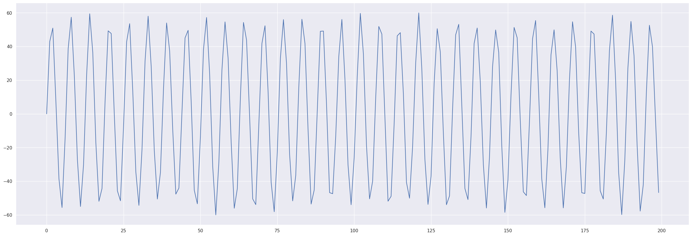

# LSTM_autoencoder

Autoencoder for anomaly detection.

# Dataset

This dataset contains eleven timeseries observations columns and one label column.


# Data Split

We will split data into training, validation and test datasets to train our autoencoder.

```
train_df, val_df = train_test_split(
  normal_df,
  test_size=0.15,
  random_state=RANDOM_SEED
)

val_df, test_df = train_test_split(
  val_df,
  test_size=0.33, 
  random_state=RANDOM_SEED
)
```

And then we will represent the data as a list of tensors using this function.

```
def create_dataset(df):

  dataset = []

  sequences = df.astype(np.float32).to_numpy().tolist()

  for ind, seq in enumerate(sequences):
    if ind+2 > len(sequences)-1:
      break

    double_seq = sequences[ind] + sequences[ind+1]

    triple_seq = double_seq + sequences[ind+2]

    triple_seq = torch.tensor(triple_seq).unsqueeze(1).float()

    dataset.append(triple_seq)

  n_seq, seq_len, n_features = torch.stack(dataset).shape

  return dataset, seq_len, n_features
  ```

# Abnormal data

To test the autoencoder we will generate fake abnormal data.



Below is a plot of generated abnormal data.



# LSTM Autoencoder

Autoencoder consists of encoder and decoder.

In encoder we will have 2 LSTM layers with embedding dimension equal to 64.


In decoder we will have 2 LSTM layers and 1 fully connected layer.


# Training

We will train our model on 75 epochs.

Loss on last epoch: train loss 0.5739964389801026 val loss 0.7613655783913352


# Prediction

We will try to make a prediction and calculate losses on normal data and abnormal generated data.


Plot of real data and Autoencoder prediction.


Plot of losses distributions on training data.


As we can see most of the errors are less than 0.9. So our threshold will be 0.9.

On train data correct normal predictions: 191/200 (95%).

# Prediction on anomaly data

Lets make prediction on anomaly data and calculate the losses.


Plot of losses distributions on anomaly data.


As we can see majority of observations have loss more than our threshold.

On abnormal data correct anomaly predictions: 136/200 (68%).
