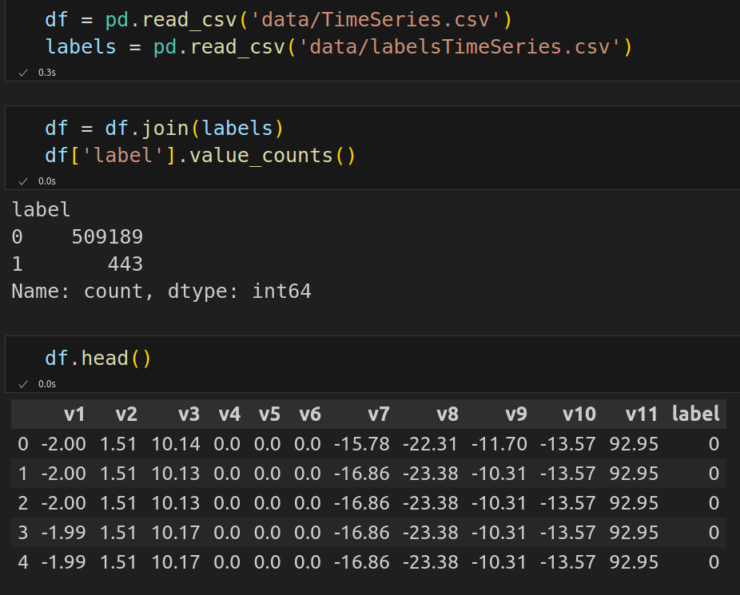
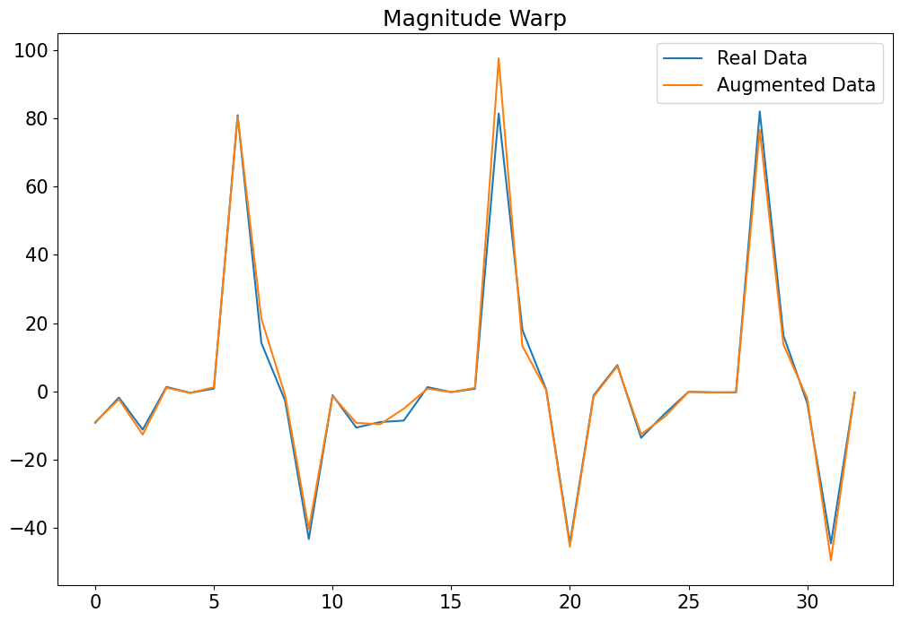

# LSTM_autoencoder

Autoencoder for anomaly detection.

# Dataset

This dataset contains eleven timeseries observations columns and one label column.



# Data Split

We will split data into training, validation and test datasets to train our autoencoder.

```
train_df, val_df = train_test_split(
  normal_df,
  test_size=0.15,
  random_state=RANDOM_SEED
)

val_df, test_df = train_test_split(
  val_df,
  test_size=0.33, 
  random_state=RANDOM_SEED
)
```

And then we will represent the data as a list of tensors using this function.

```
def create_dataset(df):

  dataset = []

  sequences = df.astype(np.float32).to_numpy().tolist()

  for ind, seq in enumerate(sequences):
    if ind+2 > len(sequences)-1:
      break

    double_seq = sequences[ind] + sequences[ind+1]

    triple_seq = double_seq + sequences[ind+2]

    triple_seq = torch.tensor(triple_seq).unsqueeze(1).float()

    dataset.append(triple_seq)

  n_seq, seq_len, n_features = torch.stack(dataset).shape

  return dataset, seq_len, n_features
  ```

# Anomaly Data Augmentation

Normal test dataset has 2198 examples, anomaly dataset has only 441 examples.

We will use five functions to augment our anomaly data.

```
def jitter(input_seq, sigma=8):
    ret = input_seq + np.random.normal(loc=0., scale=sigma, size=input_seq.shape)
    return ret
```


```
def scaling(input_seq):
  factor = np.random.normal(loc=1., scale=0.5, size=(input_seq.shape[0],input_seq.shape[1]))
  return np.multiply(input_seq, factor)
```


```
def rotation(input_seq):
  scale = np.random.choice([-0.8, 0.9], size=(input_seq.shape[0], input_seq.shape[1]))
  flipped_seq = torch.flip(input_seq, [0, 1])
  return np.multiply(flipped_seq, scale)
```


```
def permutation(input_seq):
  orig_steps = np.arange(input_seq.shape[0])

  num_segs = np.random.randint(2, 7)
  ret = np.zeros_like(input_seq)

  splits = np.array_split(orig_steps, num_segs)
  warp = np.concatenate(np.random.permutation(splits)).ravel()

  for i in range(input_seq.shape[0]-1):
    ret[i] = input_seq[warp[i]]
  
  return torch.tensor(ret).float()
```


```
def magnitude_warp(input_seq, sigma=0.3):
  from scipy.interpolate import CubicSpline

  orig_steps = np.arange(input_seq.shape[0])
  random_warps = np.random.normal(loc=1.0, scale=sigma, size=(input_seq.shape[0], input_seq.shape[1]))
  warp_steps = (np.linspace(0, input_seq.shape[0], input_seq.shape[0])).T

  ret = np.zeros_like(input_seq)

  warper = CubicSpline(warp_steps, random_warps)(orig_steps)

  ret = np.multiply(test_seq, warper)

  return ret
```
 


To augment our data we will apply three random functions to it.

```
import random

def sequence_augmentation(input_seq):
  ret = np.zeros_like(input_seq)
  aug_func_list = [jitter, scaling, rotation, permutation, magnitude_warp]

  aug_funcs = random.choices(aug_func_list, k=3)
  for func in aug_funcs:
    ret = func(input_seq)
  
  return ret
```

# LSTM Autoencoder

Autoencoder consists of encoder and decoder.

In encoder we will have 2 LSTM layers with embedding dimension equal to 64.


In decoder we will have 2 LSTM layers and 1 fully connected layer.


# Training

We will train our model on 75 epochs.

Loss on last epoch: train loss 0.5739964389801026 val loss 0.7613655783913352


# Prediction

We will try to make a prediction and calculate losses on normal data and abnormal generated data.


Plot of real data and Autoencoder prediction.


Plot of losses distributions on training data.


As we can see most of the errors are less than 0.9. So our threshold will be 0.9.

On train data correct normal predictions: 191/200 (95%).

# Prediction on anomaly data

Lets make prediction on anomaly data and calculate the losses.


Plot of losses distributions on anomaly data.


As we can see majority of observations have loss more than our threshold.

On abnormal data correct anomaly predictions: 136/200 (68%).
