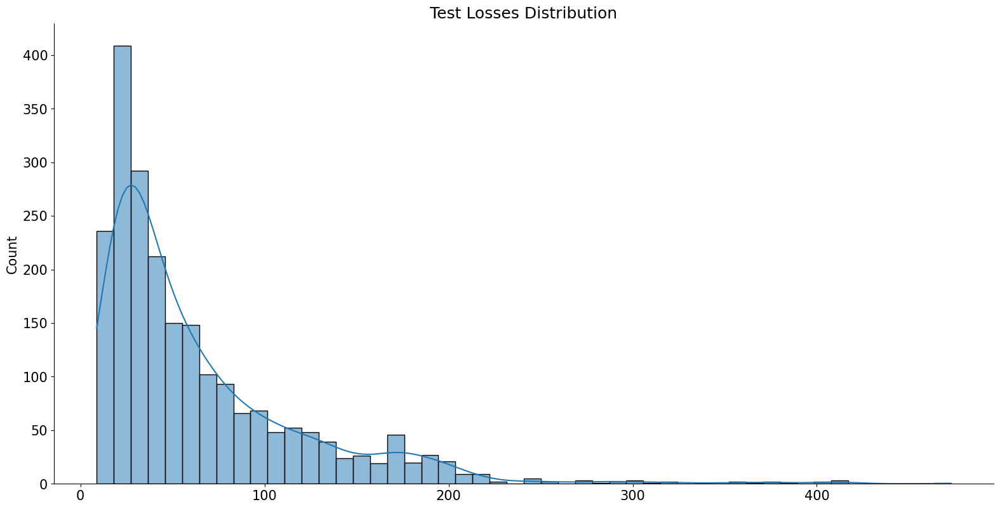

# LSTM_autoencoder

Autoencoder for anomaly detection.

# Dataset

This dataset contains eleven timeseries observations columns and one label column.


There is 509189 normal observations and 443 anomaly observations.

# Data Split

We will split data into training, validation and test datasets to train our autoencoder.

```
train_df, val_df = train_test_split(
  normal_df,
  test_size=0.15,
  random_state=RANDOM_SEED
)

val_df, test_df = train_test_split(
  val_df,
  test_size=0.33, 
  random_state=RANDOM_SEED
)
```

And then we will represent the data as a list of tensors using this function.

```
def create_dataset(df):

  dataset = []

  sequences = df.astype(np.float32).to_numpy().tolist()

  for ind, seq in enumerate(sequences):
    if ind+2 > len(sequences)-1:
      break

    double_seq = sequences[ind] + sequences[ind+1]

    triple_seq = double_seq + sequences[ind+2]

    triple_seq = torch.tensor(triple_seq).unsqueeze(1).float()

    dataset.append(triple_seq)

  n_seq, seq_len, n_features = torch.stack(dataset).shape

  return dataset, seq_len, n_features
  ```

# Anomaly Data Augmentation

Normal test dataset has 2198 examples, anomaly dataset has only 441 examples.

We will use five functions to augment our anomaly data.

```
def jitter(input_seq, sigma=8):
    ret = input_seq + np.random.normal(loc=0., scale=sigma, size=input_seq.shape)
    return ret
```


```
def scaling(input_seq):
  factor = np.random.normal(loc=1., scale=0.5, size=(input_seq.shape[0],input_seq.shape[1]))
  return np.multiply(input_seq, factor)
```


```
def rotation(input_seq):
  scale = np.random.choice([-0.8, 0.9], size=(input_seq.shape[0], input_seq.shape[1]))
  flipped_seq = torch.flip(input_seq, [0, 1])
  return np.multiply(flipped_seq, scale)
```


```
def permutation(input_seq):
  orig_steps = np.arange(input_seq.shape[0])

  num_segs = np.random.randint(2, 7)
  ret = np.zeros_like(input_seq)

  splits = np.array_split(orig_steps, num_segs)
  warp = np.concatenate(np.random.permutation(splits)).ravel()

  for i in range(input_seq.shape[0]-1):
    ret[i] = input_seq[warp[i]]
  
  return torch.tensor(ret).float()
```


```
def magnitude_warp(input_seq, sigma=0.3):
  from scipy.interpolate import CubicSpline

  orig_steps = np.arange(input_seq.shape[0])
  random_warps = np.random.normal(loc=1.0, scale=sigma, size=(input_seq.shape[0], input_seq.shape[1]))
  warp_steps = (np.linspace(0, input_seq.shape[0], input_seq.shape[0])).T

  ret = np.zeros_like(input_seq)

  warper = CubicSpline(warp_steps, random_warps)(orig_steps)

  ret = np.multiply(test_seq, warper)

  return ret
```
 


To augment our data we will apply three random functions to it.

```
import random

def sequence_augmentation(input_seq):
  ret = np.zeros_like(input_seq)
  aug_func_list = [jitter, scaling, rotation, permutation, magnitude_warp]

  aug_funcs = random.choices(aug_func_list, k=3)
  for func in aug_funcs:
    ret = func(input_seq)
  
  return ret
```

# LSTM Autoencoder

In encoder we will have 2 LSTM layers with embedding dimension equal to 8.

```
class Encoder(nn.Module):

  def __init__(self, seq_len, n_features, embedding_dim=8):
    super(Encoder, self).__init__()

    self.seq_len, self.n_features = seq_len, n_features
    self.embedding_dim, self.hidden_dim = embedding_dim, 2 * embedding_dim

    self.rnn1 = nn.LSTM(
      input_size=n_features,
      hidden_size=self.hidden_dim,
      num_layers=1,
      batch_first=True
    )
    
    self.rnn2 = nn.LSTM(
      input_size=self.hidden_dim,
      hidden_size=embedding_dim,
      num_layers=1,
      batch_first=True
    )

  def forward(self, x):
    x = x.reshape((1, self.seq_len, self.n_features))

    x, (_, _) = self.rnn1(x)
    x, (hidden_n, _) = self.rnn2(x)

    return hidden_n.reshape((self.n_features, self.embedding_dim))
```

In decoder we will have 2 LSTM layers and 1 fully connected layer.

```
class Decoder(nn.Module):

  def __init__(self, seq_len, input_dim=8, n_features=1):
    super(Decoder, self).__init__()

    self.seq_len, self.input_dim = seq_len, input_dim
    self.hidden_dim, self.n_features = 2 * input_dim, n_features

    self.rnn1 = nn.LSTM(
      input_size=input_dim,
      hidden_size=input_dim,
      num_layers=1,
      batch_first=True
    )

    self.rnn2 = nn.LSTM(
      input_size=input_dim,
      hidden_size=self.hidden_dim,
      num_layers=1,
      batch_first=True
    )

    self.output_layer = nn.Linear(self.hidden_dim, n_features)

  def forward(self, x):
    x = x.repeat(self.seq_len, self.n_features)
    x = x.reshape((self.n_features, self.seq_len, self.input_dim))

    x, (hidden_n, cell_n) = self.rnn1(x)
    x, (hidden_n, cell_n) = self.rnn2(x)
    x = x.reshape((self.seq_len, self.hidden_dim))

    return self.output_layer(x)
```

We will also create RecurrentAutoencoder class.

```
class RecurrentAutoencoder(nn.Module):

  def __init__(self, seq_len, n_features, embedding_dim=8):
    super(RecurrentAutoencoder, self).__init__()

    self.encoder = Encoder(seq_len, n_features, embedding_dim).to(device)
    self.decoder = Decoder(seq_len, embedding_dim, n_features).to(device)

  def forward(self, x):
    x = self.encoder(x)
    x = self.decoder(x)

    return x
```

# Training

We will train our model on 50 epochs.

Loss on last epoch: train loss 149.87340367753606 val loss 138.49130286623966

```
# 25 epochs -> train loss 180.47677663630532 val loss 183.84012266634377
# 50 epochs -> train loss 149.87340367753606 val loss 138.49130286623966
model, history = train_model(
  model, 
  train_dataset, 
  val_dataset, 
  n_epochs=25
)
```
Epoch 1: train loss 173.0234485338102 val loss 173.830467045009
Epoch 2: train loss 170.13741249657676 val loss 163.0115274567667
Epoch 3: train loss 154.6819239316352 val loss 156.07975191807628
Epoch 4: train loss 147.51782297085404 val loss 148.47681180408404
Epoch 5: train loss 135.9457693313517 val loss 138.00253668130665
Epoch 6: train loss 143.84492511385054 val loss 137.36569093129157
Epoch 7: train loss 130.370772684344 val loss 127.11624571148403
Epoch 8: train loss 125.37187593886732 val loss 127.60817854639724
Epoch 9: train loss 124.75291262087049 val loss 124.86089302616371
Epoch 10: train loss 127.78743457859227 val loss 156.2758279284763
Epoch 11: train loss 138.76470264734857 val loss 128.42170825011084
Epoch 12: train loss 118.95442976629661 val loss 122.7225789447002
Epoch 13: train loss 114.37499762318518 val loss 116.02722418487153
Epoch 14: train loss 113.19190553817783 val loss 118.30980463405261
Epoch 15: train loss 109.76891202139676 val loss 139.655412034481
Epoch 16: train loss 113.79430273007902 val loss 115.99430659295429
Epoch 17: train loss 109.29366252541027 val loss 104.59706768614426
Epoch 18: train loss 149.94063314260964 val loss 168.71225801236307
Epoch 19: train loss 151.43939749190255 val loss 143.21504854841524
Epoch 20: train loss 137.14129155992134 val loss 135.81897356489563
Epoch 21: train loss 131.7732696172242 val loss 130.63898295562558
Epoch 22: train loss 191.12961369250195 val loss 371.57302069566424
Epoch 23: train loss 227.30180827962673 val loss 186.358420550254
Epoch 24: train loss 180.4226437018226 val loss 171.95115998898274
Epoch 25: train loss 149.87340367753606 val loss 138.49130286623966

# Prediction

We will try to make a prediction and calculate losses on normal data and abnormal generated data.

```
def predict(model, dataset):
  predictions, losses = [], []
  criterion = nn.L1Loss(reduction='sum').to(device)

  with torch.no_grad():
    model = model.eval()
    for seq_true in dataset:
      seq_true = seq_true.to(device)
      seq_pred = model(seq_true)

      loss = criterion(seq_pred, seq_true)

      predictions.append(seq_pred.cpu().numpy().flatten())
      losses.append(loss.item())
  return predictions, losses
```

# Prediction on normal data

Lets plot losses distributions on normal test data.



# Prediction on anomaly data

Plot losses distributions on anomaly data.


Our threshold will be 175.

Correct normal predictions percantage: 0.8585077343039127

Correct anomaly predictions percantage: 0.8798908098271155

# Examples


We can see that loss on anomaly data is bigger than on normal data.
