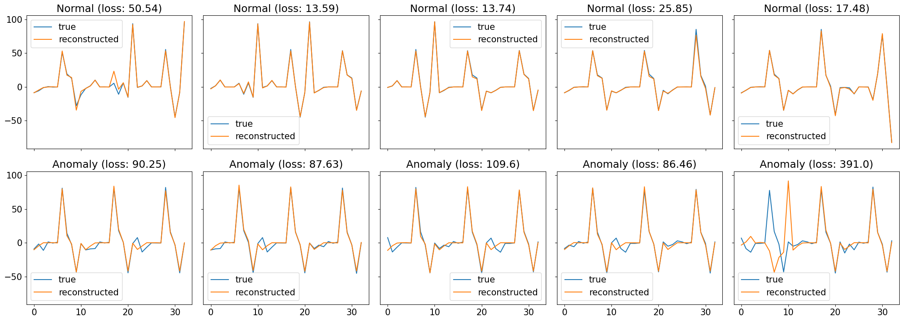

# LSTM_autoencoder

Autoencoder for anomaly detection.

This project is based on https://github.com/curiousily/Getting-Things-Done-with-Pytorch/blob/master/06.time-series-anomaly-detection-ecg.ipynb.

# Dataset

This dataset contains eleven timeseries observations columns and one label column.


There is 509189 normal observations and 443 anomaly observations.

# Data Split

We will split data into training, validation and test datasets to train our autoencoder.

```
train_df, val_df = train_test_split(
  normal_df,
  test_size=0.15,
  random_state=RANDOM_SEED
)

val_df, test_df = train_test_split(
  val_df,
  test_size=0.33, 
  random_state=RANDOM_SEED
)
```

And then we will represent the data as a list of tensors using this function.

```
def create_dataset(df):

  dataset = []

  sequences = df.astype(np.float32).to_numpy().tolist()

  for ind, seq in enumerate(sequences):
    if ind+2 > len(sequences)-1:
      break

    double_seq = sequences[ind] + sequences[ind+1]

    triple_seq = double_seq + sequences[ind+2]

    triple_seq = torch.tensor(triple_seq).unsqueeze(1).float()

    dataset.append(triple_seq)

  n_seq, seq_len, n_features = torch.stack(dataset).shape

  return dataset, seq_len, n_features
  ```

# Anomaly Data Augmentation

Normal test dataset has 2198 examples, anomaly dataset has only 441 examples.

We will use three functions to augment our anomaly data.

```
def jitter(input_seq, sigma=8):
    ret = input_seq + np.random.normal(loc=0., scale=sigma, size=input_seq.shape)
    return ret
```


```
def scaling(input_seq):
  factor = np.random.normal(loc=1., scale=0.5, size=(input_seq.shape[0],input_seq.shape[1]))
  return np.multiply(input_seq, factor)
```


```
def magnitude_warp(input_seq, sigma=0.3):
  from scipy.interpolate import CubicSpline

  orig_steps = np.arange(input_seq.shape[0])
  random_warps = np.random.normal(loc=1.0, scale=sigma, size=(input_seq.shape[0], input_seq.shape[1]))
  warp_steps = (np.linspace(0, input_seq.shape[0], input_seq.shape[0])).T

  ret = np.zeros_like(input_seq)

  warper = CubicSpline(warp_steps, random_warps)(orig_steps)

  ret = np.multiply(test_seq, warper)

  return ret
```
 


To augment our data we will shuffle aug_func_list and then apply all three functions.

```
import random

def sequence_augmentation(input_seq):
  ret = np.zeros_like(input_seq)
  aug_func_list = [jitter, scaling, magnitude_warp]

  random.shuffle(aug_func_list)
  for func in aug_func_list:
    ret = func(input_seq)
  
  return ret
```

# LSTM Autoencoder

In encoder we will have 2 LSTM layers with embedding dimension equal to 8.

```
class Encoder(nn.Module):

  def __init__(self, seq_len, n_features, embedding_dim=8):
    super(Encoder, self).__init__()

    self.seq_len, self.n_features = seq_len, n_features
    self.embedding_dim, self.hidden_dim = embedding_dim, 2 * embedding_dim

    self.rnn1 = nn.LSTM(
      input_size=n_features,
      hidden_size=self.hidden_dim,
      num_layers=1,
      batch_first=True
    )
    
    self.rnn2 = nn.LSTM(
      input_size=self.hidden_dim,
      hidden_size=embedding_dim,
      num_layers=1,
      batch_first=True
    )

  def forward(self, x):
    x = x.reshape((1, self.seq_len, self.n_features))

    x, (_, _) = self.rnn1(x)
    x, (hidden_n, _) = self.rnn2(x)

    return hidden_n.reshape((self.n_features, self.embedding_dim))
```

In decoder we will have 2 LSTM layers and 1 fully connected layer.

```
class Decoder(nn.Module):

  def __init__(self, seq_len, input_dim=8, n_features=1):
    super(Decoder, self).__init__()

    self.seq_len, self.input_dim = seq_len, input_dim
    self.hidden_dim, self.n_features = 2 * input_dim, n_features

    self.rnn1 = nn.LSTM(
      input_size=input_dim,
      hidden_size=input_dim,
      num_layers=1,
      batch_first=True
    )

    self.rnn2 = nn.LSTM(
      input_size=input_dim,
      hidden_size=self.hidden_dim,
      num_layers=1,
      batch_first=True
    )

    self.output_layer = nn.Linear(self.hidden_dim, n_features)

  def forward(self, x):
    x = x.repeat(self.seq_len, self.n_features)
    x = x.reshape((self.n_features, self.seq_len, self.input_dim))

    x, (hidden_n, cell_n) = self.rnn1(x)
    x, (hidden_n, cell_n) = self.rnn2(x)
    x = x.reshape((self.seq_len, self.hidden_dim))

    return self.output_layer(x)
```

We will also create RecurrentAutoencoder class.

```
class RecurrentAutoencoder(nn.Module):

  def __init__(self, seq_len, n_features, embedding_dim=8):
    super(RecurrentAutoencoder, self).__init__()

    self.encoder = Encoder(seq_len, n_features, embedding_dim).to(device)
    self.decoder = Decoder(seq_len, embedding_dim, n_features).to(device)

  def forward(self, x):
    x = self.encoder(x)
    x = self.decoder(x)

    return x
```

# Training

We will train our model on 100 epochs.

Loss on last epoch: train loss 88.83148236176078 val loss 69.62334083394063

```
# Epoch 50: train loss 156.2315734545462 val loss 189.10611869270772
# Epoch 75: train loss 100.44923457125962 val loss 166.5826284700006
# Epoch 100: train loss 88.83148236176078 val loss 69.62334083394063
model, history = train_model(
  model, 
  train_dataset, 
  val_dataset, 
  n_epochs=25
)
```

# Prediction

We will try to make a prediction and calculate losses on normal data and abnormal generated data.

```
def predict(model, dataset):
  predictions, losses = [], []
  criterion = nn.L1Loss(reduction='sum').to(device)

  with torch.no_grad():
    model = model.eval()
    for seq_true in dataset:
      seq_true = seq_true.to(device)
      seq_pred = model(seq_true)

      loss = criterion(seq_pred, seq_true)

      predictions.append(seq_pred.cpu().numpy().flatten())
      losses.append(loss.item())
  return predictions, losses
```

# Prediction on normal data

Lets plot losses distributions on normal test data.


# Prediction on anomaly data

Plot losses distributions on anomaly data.


Our threshold will be 135.

Correct normal predictions percantage: 0.8867151956323931

Correct anomaly predictions percantage: 0.9071883530482256

# Examples



We can see that loss on anomaly data is bigger than on normal data.
